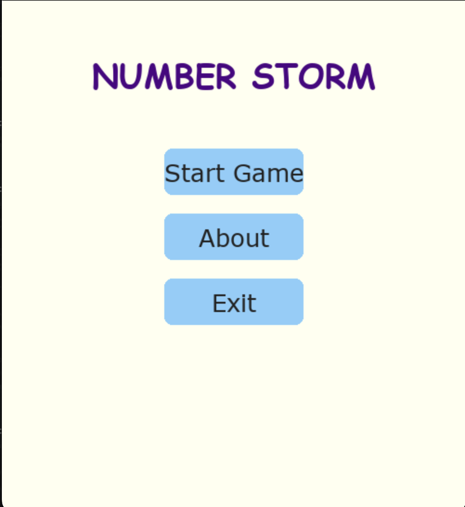
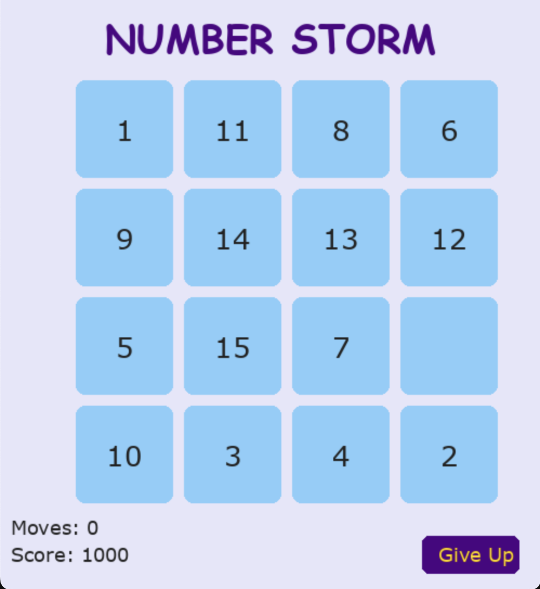

# number-storm
# Number Storm 🧩⚡️

**Number Storm** is a fun and colorful version of the classic 15-tile puzzle game built using Python and Pygame. Your goal is to arrange numbers from 1 to 15 in ascending order by moving tiles using arrow keys.

---

## 🎮 Features

- 💠 Beautifully themed tile puzzle grid
- 🎨 Soft pastel UI and playful fonts
- 👇 Arrow-key controlled gameplay
- 📊 Real-time move and score tracker
- 🤪 Minions-themed About section for extra fun!

---

## 📷 Screenshots

> 
> 
> 

---

## 🛠️ Requirements

- Python 3.6+
- Pygame

Install dependencies:
```bash
pip install pygame
```

---

## 🚀 Running the Game

```bash
python number_storm.py
```

Use the arrow keys to move tiles:
- ⬅️ Left
- ➡️ Right
- ⬆️ Up
- ⬇️ Down

---

## 📁 File Structure

```
number-storm/
├── number_storm.py            # Main game logic
├── pngimg.com - minions_PNG72.png  # Minions image used in About section
├── README.md                  # Project overview
├── .gitignore                 # Ignore cache/__pycache__ files
```

---

## 💡 Inspiration

Inspired by the classic sliding puzzle and made playful with colorful visuals and Minion magic! 🎉

---

## 📄 License

This project is for educational and fun use only. All Minions assets are property of their respective owners.

---

Made with 💙 using Python + Pygame.
